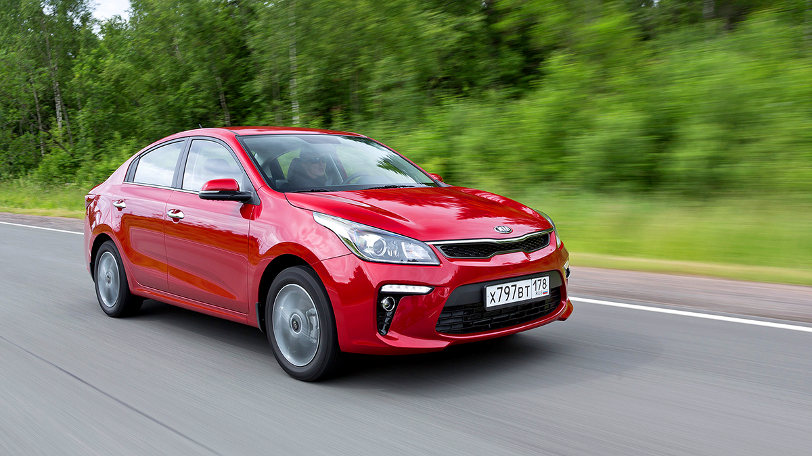
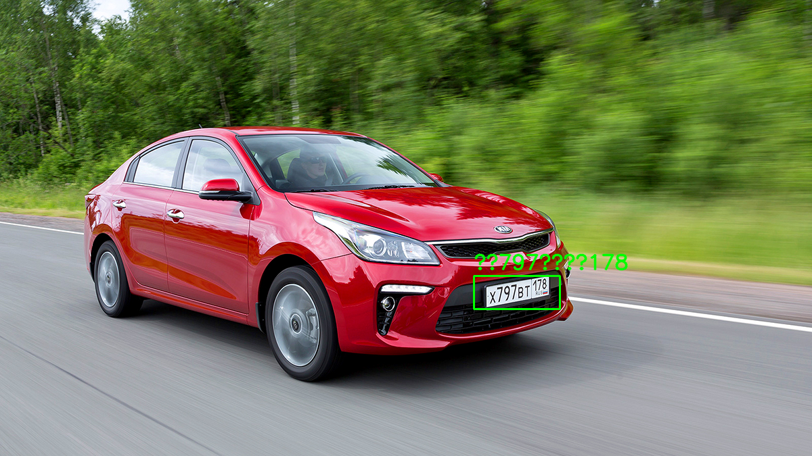
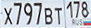

# detect-number-rus-car

Скрипт для распознавания российских автомобильных номеров по изображению.

Проект делает 2 шага:

1. `YOLO` находит номерной знак на изображении.
2. `Tesseract OCR` читает текст номера с вырезанного и выровненного кропа.

Дополнительно в пайплайне есть:

- усиленная предобработка для маленьких и шумных кропов
- repair-логика для типового шаблона российского номера
- fallback для low-resolution изображений

## Что лежит в проекте

- `exp.pt` — обученные веса детектора номерных знаков.
- `plate_ocr.py` — основной скрипт для детекции и OCR.

## Требования

- Python `3.11+`
- `tesseract` установлен в системе
- macOS/Linux терминал

## Установка

Создай виртуальное окружение:

```bash
python3 -m venv .venv
```

Активируй его:

```bash
source .venv/bin/activate
```

Установи Python-зависимости:

```bash
pip install -r requirements.txt
```

Установи `tesseract`:

### macOS

```bash
brew install tesseract
```

### Ubuntu/Debian

```bash
sudo apt update
sudo apt install tesseract-ocr
```

## Запуск

Пример запуска на одном изображении:

```bash
.venv/bin/python plate_ocr.py --model exp.pt --source image.png
```

Или после активации окружения:

```bash
python plate_ocr.py --model exp.pt --source image.png
```

Пример запуска на произвольном файле:

```bash
python plate_ocr.py --model exp.pt --source "/полный/путь/к/фото.jpg"
```

## Аргументы

- `--model` — путь к весам YOLO, по умолчанию `exp.pt`
- `--source` — путь к изображению
- `--output-dir` — папка для результатов, по умолчанию `runs/ocr`
- `--conf` — порог уверенности детектора
- `--padding` — дополнительный отступ вокруг номера

## Результаты

После запуска появится папка вида:

```bash
runs/ocr/<имя_файла>/
```

В ней будут:

- `plate_crop.png` — исходный кроп номерного знака
- `plate_warped.png` — выровненный номер для OCR
- `annotated.png` — исходное изображение с боксом и текстом
- `result.json` — полный отчет с OCR-кандидатами

В терминале скрипт выводит краткий JSON:

```json
{
  "plate_text": "Х797ВТ178",
  "plate_text_latin": "X797BT178",
  "detection_confidence": 0.5786
}
```

## Пример

Для `image.png` скрипт распознал номер:

```text
Х797ВТ178
```

### Исходное фото



### Результат детекции и OCR



### Выровненный номер для OCR



## Еще один пример

Для фотографии автомобиля сзади скрипт корректно распознает:

```text
В888ВВ88
```

Это полезный кейс для обычного полноразмерного номера без экстремального апскейла.
